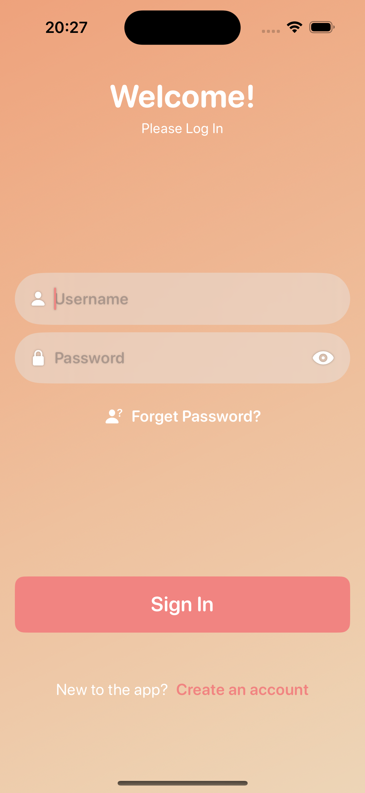
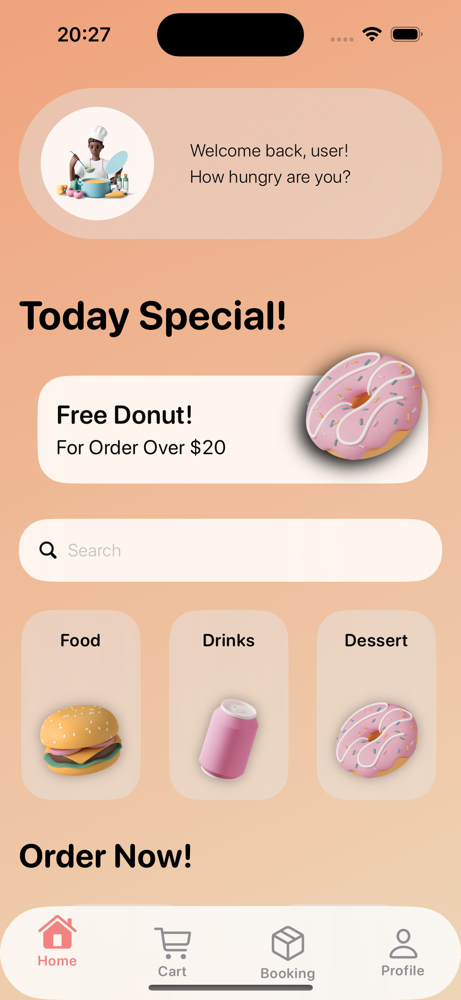
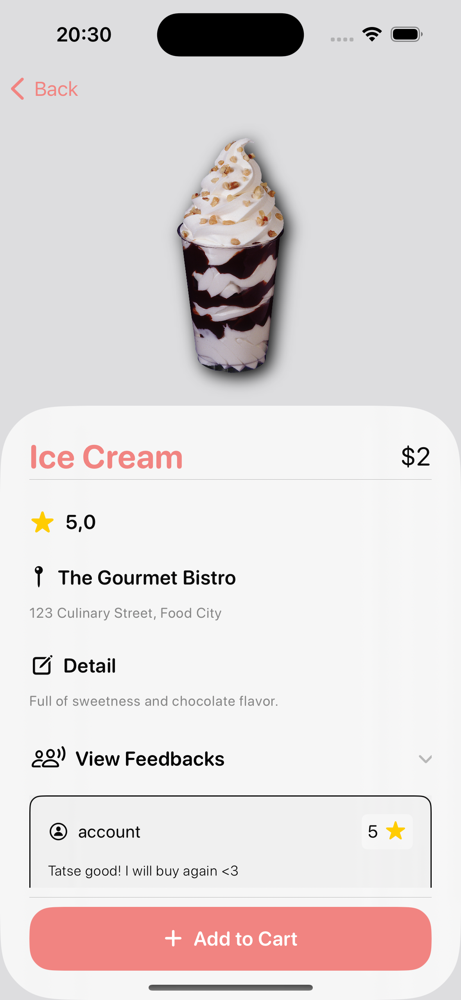
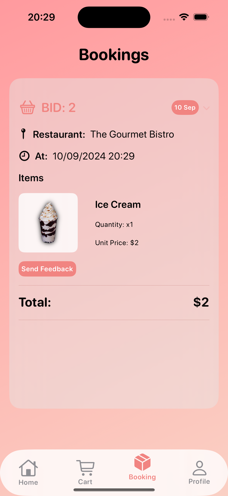
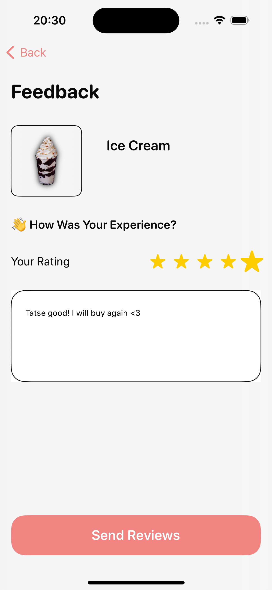
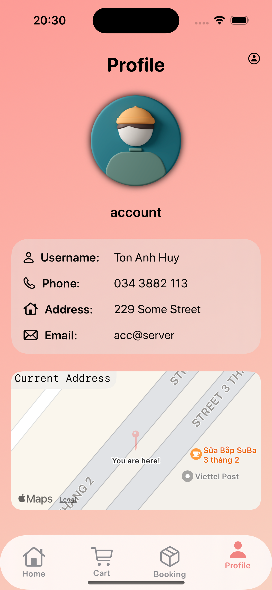

# iOS Food Booking App

---

## Overview

**iOS target version**: 17.4

A SwiftUI-based iOS application that allows user to browse food menus, place orders, send feedbacks and manage user profile

**Demo video**: https://www.youtube.com/watch?v=-2f22Dx-Whk

## Features

- Sign up
- Sign in
- User profile management
- Browse restaurants menu and categories
- Search and filter menu items
- Booking service
- Display and sending user feedbacks
- Support for multithreading, networking tasks

## Tech Stack

- SwiftUI for building application’s UI
- MVVM architecture
- MapKit for location service
- Node.js backend with JWT authentication/authorization running on EC2 instance
- PostgreSQL running on RDS for storage
- S3 for storing images

## Screens

<table>
  <tr>
    <td></td>
    <td></td>
  </tr>
  <tr>
    <td></td>
    <td></td>
  </tr>
<tr>
    <td></td>
    <td></td>
  </tr>
</table>

## Usage

1. Clone the repository
2. Install all dependencies by running `npm install`
3.  Create your own `.env` file

**Note**: the repository use the local server. In demo video, the app will run on a real iOS device and communicate with server (running on EC2)

## API Endpoints

- POST `/auth/login` : User authentication
- POST `/auth/register`: Registration
- PATCH `/profile/:username` : Edit user’s profile
- GET `/restaurants` : Get all restaurants
- GET `/restaurants/:id` : Get restaurant by ID
- GET `/menu-items` : Get all menu items
- GET `/menu-items/:id` : Get menu items by ID
- GET `/menu-items/:id/feedbacks` : Get all feedbacks of a specific menu item by ID
- GET `/booking` : Get all user’s booking
- POST `/booking/feedbacks`: Sending feedback for a specific order
- POST `/booking` : Place an order

## Contact

- Email: huyton2203@gmail.com
